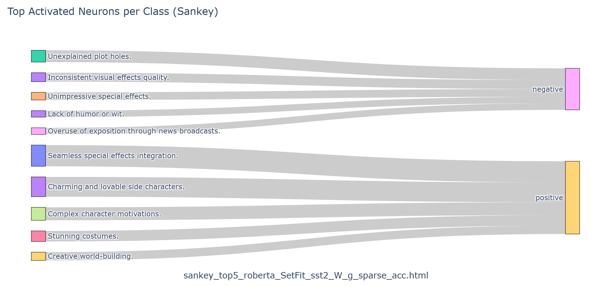

# Concept-Bottleneck-LLM

This is the extended and reproduced implementation of the paper: [Concept Bottleneck Large Language Models](https://arxiv.org/abs/2412.07992).  
We faithfully reproduce the CB-LLM classification pipeline and introduce two additional contributions:
- **NEC (Number of Effective Concepts) Analysis**: Study the effect of sparsity on performance.
- **BCE-trained Concept Bottleneck Layer**: Explore alternative concept training objectives.

This repo is adapted to run under limited GPU resources and includes updates to improve efficiency and compatibility.

---

### 🔧 Setup

We recommend using:
- CUDA 12.1  
- Python 3.10  
- PyTorch 2.2  

After cloning the repo, install dependencies:
```bash
cd classification
pip install -r requirements.txt
```

Note: We updated torchvision in requirements.txt from `0.17.0` to `0.19.0` for compatibility.

Download the finetuned CB-LLM checkpoints from HuggingFace:
```bash
git lfs install
git clone https://huggingface.co/cesun/cbllm-classification temp_repo
mv temp_repo/mpnet_acs .
rm -rf temp_repo
```

---

## 📊 Part I: CB-LLM (Classification)

###  Automatic Concept Scoring (ACS)
To generate concept scores for a dataset, run:
```bash
python get_concept_labels.py
```

This will generate the concept scores for the SST2 dataset using our predefined concept set, and store the scores under `mpnet_acs/SetFit_sst2/`. Set the argument `--dataset ag_news`, `--dataset yelp_polarity`, or `--dataset dbpedia_14` to switch the dataset.

**Updates:**

- Reduced `batch_size` for large datasets.
- Cast model weights and features to `float16`.
- Used efficient batching for tokenization.

### Train the Concept Bottleneck Layer (CBL)
To train the CBL, run
```bash
python train_CBL.py --automatic_concept_correction
```

This will train the CBL with Automatic Concept Correction for the SST2 dataset, and store the model under `mpnet_acs/SetFit_sst2/roberta_cbm/`. To disable Automatic Concept Correction, remove the given argument. Set the argument `--backbone gpt2` to switch the backbone from roberta to gpt2. Set the argument `--dataset ag_news`, `--dataset yelp_polarity`, or `--dataset dbpedia_14` to switch the dataset.

**Update:**
Checkpoints are saved automatically to avoid losing progress if your connection breaks.

### Train the Final Predictor
To train the final predictor, run:
```bash
python train_FL.py --cbl_path mpnet_acs/SetFit_sst2/roberta_cbm/cbl_acc.pt
```

This will train the linear predictor of the CBL for the SST2 dataset, and store the linear layer in the same directory.
Please change the argument `--cbl_path` accordingly for other settings.
For example, without Automatic Concept Correction, the model will be saved as `cbl.pt`.

**Update:**
The code now supports more flexible backbone detection (e.g. both `roberta` and `gpt2` in string).

### Train the Baseline Black-box Model
To train the baseline standard black-box model, run
```bash
python finetune_black_box.py

```
This will train the black-box (non-interpretable) model for the SST2 dataset, and store the model under `baseline_models/roberta/`.
Set the argument `--backbone gpt2` to switch backbone or `--dataset ag_news`, `--dataset yelp_polarity`, or `--dataset dbpedia_14` to switch the dataset.

**Update:**
Reduced batch_size for large datasets and added checkpoints.

### Testing
#### Test CB-LLM (classification)
To test the accuracy of the CB-LLM, run
```bash
python test_CBLLM.py --cbl_path mpnet_acs/SetFit_sst2/roberta_cbm/cbl_acc.pt
```
Please change the argument `--cbl_path` accordingly if using other settings. For example, w/o Automatic Concept Correction will be save as `cbl.pt`. Add the `--sparse` argument for testing with the sparse final layer.
#### Test the baseline black-box model
To test the accuracy of the baseline standard black-box model, run
```bash
python test_black_box.py --model_path baseline_models/roberta/backbone_finetuned_sst2.pt
```
Set the argument `--dataset yelp_polarity`, `--dataset ag_news`, or `--dataset dbpedia_14` to switch the dataset. Please change the argument `--model_path` accordingly if using other settings.

### Generate Explanations from CB-LLM
To visualize the neurons in CB-LLM (task 1 in our paper), run
```bash
python print_concept_activations.py --cbl_path mpnet_acs/SetFit_sst2/roberta_cbm/cbl_acc.pt
```
This will generate 5 most related samples for each neuron explanation. Please change the argument `--cbl_path` accordingly if using other settings.

To get the explanations provided by CB-LLM (task 2 in our paper), run
```bash
python print_concept_contributions.py --cbl_path mpnet_acs/SetFit_sst2/roberta_cbm/cbl_acc.pt
```
This will generate 5 explanations for each sample in the dataset. Please change the argument `--cbl_path` accordingly if using other settings.

### Plot Top activated neurons from final layer
To get the top 5 activated neurons in CB-LLMs trained w/ ACC w/ Sparse FL in dataset SST2 (RoBERTa backbone), run
```bash
python visualize_neuron.py \
--dataset SetFit/sst2 \
--model roberta \
--w_path mpnet_acs/SetFit_sst2/roberta_cbm/W_g_sparse_acc.pt \
--b_path mpnet_acs/SetFit_sst2/roberta_cbm/b_g_sparse_acc.pt \
--top_k 5 \
--plot
```
This will store the sankey plot in `/classification/mpnet_acs/SetFit_sst2/roberta_plot`. Set the argument `--dataset ag_news` to switch the dataset. Please change the argument `--model`, `--w_path`, `--b-path`, and `--top_k` accordingly if using other settings. Add `--plot` to visualize and save the weights. For example,
<p align="center">
  
</p>


## 🧪 Additional Experiments

### NEC (Number of Effective Concepts) Analysis
To train and evaluate at various sparsity levels, run:
```bash
python train_FL_nec.py --cbl_path mpnet_acs/SetFit_sst2/roberta_cbm/cbl_acc.pt
```

This will train and evaluate the final predictor with different levels of sparsity (effective concepts), saving each configuration's weights and accuracy logs.
**Details:**

Uses `weight_truncation` in `utils.py` and updated `glm_saga` in `glm_saga/elasticnet.py`.
Trains and saves model at `measure_level = (5, 10, ... 100)` effective concepts.
Stores results under `.../<backbone>_nec/`.

#### Test NEC accuracy for CB-LLM
```bash
python test_CBLLM.py --cbl_path mpnet_acs/SetFit_sst2/roberta_cbm_nec/cbl_acc.pt --NEC 5
```
Evaluates test accuracy at each NEC level for a given CB-LLM model.

#### Test NEC accuracy for Black-box
```bash
python test_black_box_nec.py --model_path baseline_models/roberta/backbone_finetuned_sst2.pt

```
Evaluates NEC-constrained accuracy for black-box models, for comparison with CB-LLM.

## Key Results
